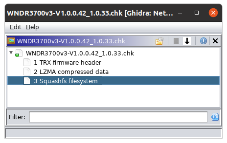
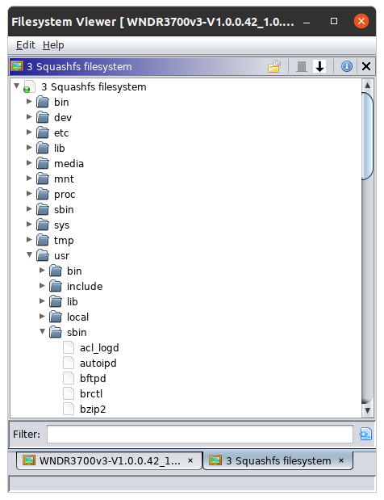
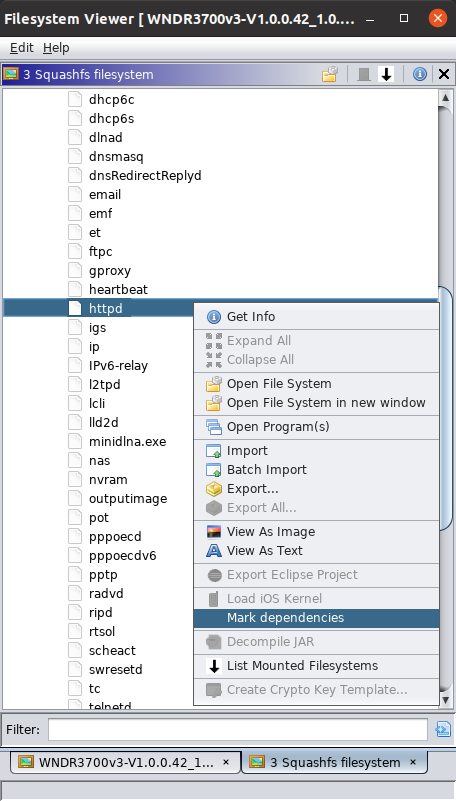
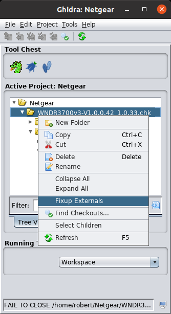

# Ghidra Firmware Toolkit

This project is a [Ghidra](https://ghidra-sre.org/) extension adding filesystems, filesystem functionality
and multifile functionality which I find useful when working with firmware images.

Look here for a demo: https://www.youtube.com/watch?v=-rjoMC27gaU

## Build

Build this with a recent version of [Gradle](https://gradle.org/) having set the
`$GHIDRA_INSTALL_DIR` environment variable to point to your Ghidra installation. You will
find the result in the `dist` directory.

## Install

Start up Ghidra and install the extension through `File->Install Extensions...` and restart
Ghidra.

This extension adds functionality to the front end tool and it seems like this has to be
enabled manually so go to `File->Configure->Miscellaneous` and tick off the `FirmwarePlugin`.

Now you should be ready to roll.

## Configure

You need [binwalk](https://github.com/ReFirmLabs/binwalk) and [sasquatch](https://github.com/devttys0/sasquatch)
installed in order for this to work. Go to `Edit->Tool Options...` and find the `Firmware plugin`
options. Point the paths to your binaries:

## Added functionality

So, what do you get from this extension? Read on.

### BinwalkFS

Go to `File->Open File System...` and choose a filesystem image. This will now (with a little
bit of luck) be read by `binwalk` and the result shown in the filesystem browser:

### SasquatchFS

Same as with the BinwalkFS but now Sasquatch is used to parse out the filesystem. You can also
do this from the filesystem browser after having opened a firmware image.

### Mark dependenies

When you have marked an ELF binary in the filesystem browser you can now right click and choose
`Mark Dependencies` to mark all needed libraries. Now you can do a bulk import.

### Fix externals

With Ghidra you can follow function calls to their implementation in an external library if you
have set up its external programs correctly but this is a tedious process. Put all your binaries
and needed libraries in a shared folder (or subfolders) and right click the top most folder and
choose 'Fixup Externals' and this will be done for you.

If you have multiple files from different filesystems they should be separated into different
subfolders or this fixup may link a binary from one filesystem to a library from another one.

